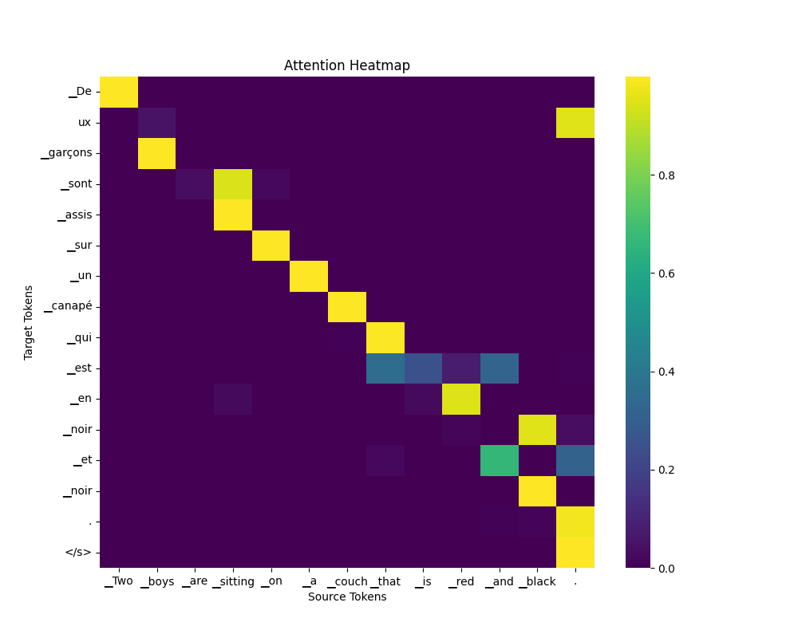

# NLP Representation Learning and Machine Translation

## Overview

This repository contains Natural Language Processing projects completed during my MSc Artificial Intelligence at Heriot-Watt University.

The work investigates two connected areas of NLP:

1. Representation learning using Word2Vec embeddings
2. Neural machine translation using BiLSTM encoder-decoder architectures with attention mechanisms and decoder-only Transformer models

The projects evaluate how modelling choices influence representation quality and translation performance through systematic experimentation and quantitative evaluation.

## Project 1 – Word2Vec Representation Learning

## Objective

Investigate how corpus size and model hyperparameters influence the quality of learned semantic word representations.

## Experimental Design

Word2Vec embeddings were trained on the WikiText-103 corpus using both small and large corpus variants. Representation quality was evaluated using cosine similarity, Spearman correlation against human similarity judgements, comparison with pretrained Google News embeddings, analogy reasoning, and systematic hyperparameter experiments.

### Implementation

The project involved:

* Training Word2Vec embeddings on WikiText-103 small and large corpora
* Preprocessing text through tokenisation and stopword removal
* Evaluating semantic similarity using cosine similarity and Spearman correlation
* Comparing custom embeddings with pretrained Google News embeddings
* Investigating the effects of embedding dimensionality, corpus size, context window, and vocabulary size through hyperparameter experiments
* Exploring semantic analogies and gender-related bias in pretrained embeddings

### Key Findings

- Larger corpora produced substantially stronger semantic representations than smaller datasets.
- Increasing embedding dimensionality improved performance on the large corpus, but provided limited benefit for the small corpus.
- The best tuned Word2Vec model achieved a Spearman correlation of approximately 0.644.
- Pretrained Google News embeddings achieved stronger alignment with human semantic judgements, with a Spearman correlation of approximately 0.683.
- Analogy experiments demonstrated that learned embeddings captured semantic relationships while also revealing gender-related biases inherited from training data.

## Limitations

The custom embeddings were trained on relatively small corpora compared with industrial-scale pretrained models. Consequently, evaluation scores remained below the Google News embeddings despite hyperparameter optimisation. 

## Project 2: Neural Machine Translation

## Objective

Investigate how neural sequence models and Transformer architectures influence machine translation performance.

## Experimental Design

English-to-French neural machine translation models were implemented using the Multi30k parallel corpus. BiLSTM encoder-decoder architectures with attention mechanisms and Transformer models were trained and evaluated using BLEU scores alongside qualitative analysis of generated translations.

### Implementation

The project involved:

* Implementing BiLSTM encoder-decoder architectures with global attention
* Implementing and evaluating decoder-only Transformer models with multi-head attention
* Comparing model capacity through controlled hyperparameter experiments
* Evaluating translation quality using BLEU scores
* Analysing attention heatmaps to interpret model behaviour
* Performing qualitative error analysis on generated translations across different linguistic phenomena

### Key Findings

- Increasing model capacity improved translation performance substantially.
- Medium-sized models achieved stronger BLEU scores than smaller models.
- The best submitted BiLSTM model achieved a BLEU score of approximately 49.17.
- The large Transformer model achieved a BLEU score of approximately 49.74.
- Training larger models was limited by available computational resources.
- BLEU scores provided a quantitative measure of translation quality, while qualitative analysis helped identify grammatical errors, semantic inaccuracies, and patterns that numerical scores alone could not capture.
- W&B was used to monitor training and validation loss across model runs.
- Attention heatmaps were used to inspect model behaviour and support qualitative translation analysis.

## Limitations

Model performance was constrained by available computational resources, limiting further exploration of larger architectures and longer training schedules. Future work could investigate larger Transformer models, pretrained multilingual language models, and additional evaluation metrics beyond BLEU.

## Example Results

The figures below show representative attention visualisations produced by the BiLSTM and Transformer models during translation. Additional visualisations are available in the [machine-translation/part3](machine-translation/part3/) directory.

### BiLSTM Encoder–Decoder Attention

The attention heatmap illustrates how the BiLSTM encoder-decoder model aligns source and target tokens during translation, showing strong word-level correspondences and interpretable alignment patterns.

### Decoder-only Transformer Attention

The visualisation illustrates attention distributions across multiple layers and attention heads in the decoder-only Transformer model, demonstrating how different attention heads capture complementary linguistic relationships between tokens during translation.

## Technologies Used

* Python
* PyTorch
* Gensim
* NLTK
* NumPy
* pandas
* Weights & Biases

## Notes

This repository is intended for portfolio and educational purposes. The experiments can be reproduced using the provided notebooks and the referenced datasets and code dependencies.

## Author

**Mercy Nthiwa**

MSc Artificial Intelligence  
Heriot-Watt University

**Interests:** Artificial Intelligence, Natural Language Processing, Machine Learning, and AI for Healthcare.